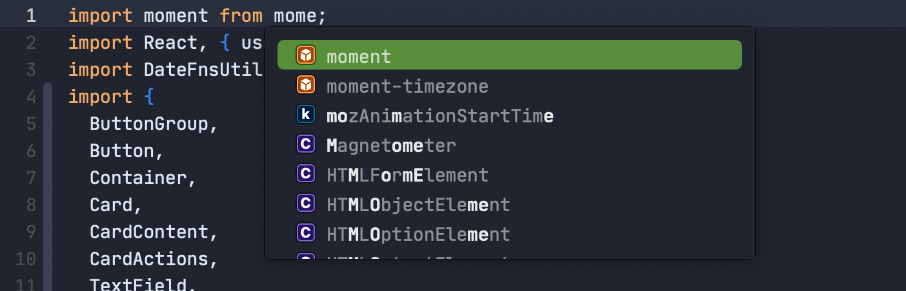
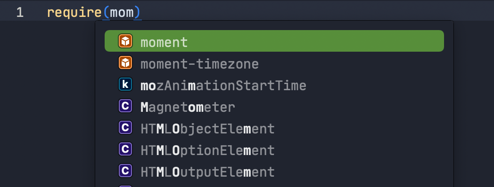

# NPM Imports

**npm imports** provides completions for npm dependencies found in your `package.json`.

### Configuration

You can configure whether the extension uses a single quote or a double quote when inserting package names in **Project → Project Settings...**

## Contributors

[lnenad](https://github.com/lnenad)

## Sponsors

[Mockadillo](https://mockadillo.com)
